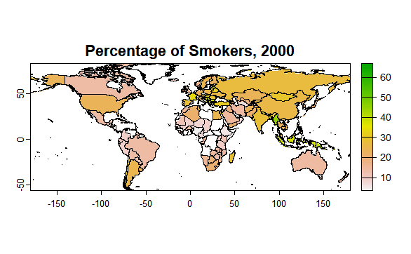
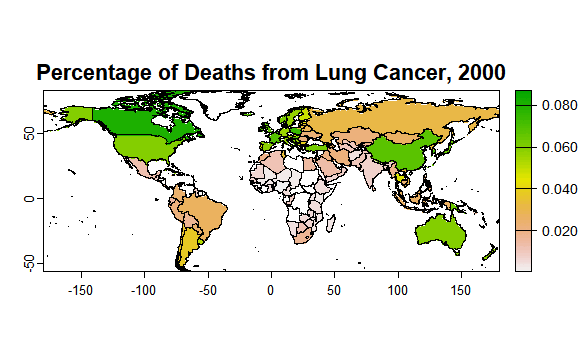

```{=html}
<style>
    nav {
        background-color: white;
        color: black;
        padding: 10px;
        border-top: 2px solid black;
        border-bottom: 2px solid black;
    }

    nav ul {
        list-style-type: none;
        padding: 0;
        margin: 0;
    }

    nav ul li {
        display: inline;
        margin-right: 10px;
    }

    nav ul li a {
        color: black;
        text-decoration: none;
    }

    /* Style for sections */
    section {
        margin: 20px;
    }

    section h2 {
        color: #333;
    }

    section p {
        color: #666;
    }

    body {
        font-family: Cambria, serif;
    }
</style>
```
<nav>

<ul>

<li><a href="#intro">Introduction</a></li>

<li><a href="#eda">Datasets</a></li>

<li><a href="#stat">Statistical Analysis</a></li>

<li><a href="#conc">Conclusion</a></li>

<li><a href="#ref">References</a></li>

<li><a href="#app">Appendix</a></li>

</ul>

</nav>

```{r setup, include=FALSE}
knitr::opts_chunk$set(echo = FALSE)

# libraries
library(dplyr)
library(tidyverse)
library(stringdist)
library(terra)
library(geodata)
library(ggplot2)
library(knitr)

```


*Image source: metrodental.com*

## Introduction <a id="intro"></a>

This project aims to investigate the effect of nicotine/tobacco use on public health, quantified by deaths from smoking or lung cancer. Over the years, smoking trends have gone through many changes. In the early 1900s, the age of initiation (i.e. the age an individual started smoking) decreased progressively; in the 1930's, the average age at initiation fell to below 18 years of age (Burns et al., 1997; Thun et al., 1997). However, as more information on the risks of lung cancer associated with smoking was discovered, the proportion of smokers started decreasing rapidly. In 1959, the first smoking mortality study involving both men and women was conducted by the American Cancer Society. This study found that while the relative risk of death from lung cancer after 6 years of smoking (compared to non-smokers) was only 2.69 (U.S. General, 1990), the relative risk of death from lung cancer after 20 to 25 years was 11.94 for male smokers and 22.36 for female smokers (Thun et al., 1995). Because of these studies, the prevalence in smoking in both sexes has decreased since their peaks in to 1970's (male) and 1980's (female) (Burns et al., 2003). While there is a large amount of research on the correlation between smoking and lung cancer, the majority of this research is based the U.S. or similarly high-income countries, indicating the need for research on this correlation on a global scale.

Although the population that smokes has decreased considerably, there is still a sizable population that is affected by these health risks today. Because of the addictive effects of tobacco, quitting is a challenge that persists in the population. Additionally, female smokers have been reported to have more difficulty quitting smoking than men, which has resulted in the year spent smoking for women increasing (Chahine et al., 2011). Therefore, it is of importance that highlighting methods in decreasing smoking, specifically those that can be controlled by the government. A few examples of these methods employed by governments in the past include increasing taxes and tariffs on tobacco products, increasing funding in anti-tobacco and smoking public service announcements (PSAs), and increasing funding in addiction and rehabilitation programs (Goel & Nelson, 2006; Hu et al., 1995). This study will focus on the effects of increasing prices, including taxes, of tobacco products on prevalence of smoking.

Overall, this project will answer two main research questions. First, how does the percentage of adults who smoke per country affect lung cancer deaths? Second, how does the differences in price of tobacco products affect the sale of cigarettes and tobacco products? By answering these questions, the goal is to illuminate how tobacco use has changed over the years, as well as determine the best methods in preventing tobacco use.

## Datasets <a id="eda"></a>

### Question 1

**How does the percentage of adults who smoke per country affect lung cancer deaths?**

#### Data acquisition

For the first question of this project, I will utilize global data for the share of adults who smoke [Dataset 1 or `ds_1`] and global data for lung cancer deaths [Dataset 2 or `ds_2`]. The two datasets were merged into Dataset A, or `ds_A`. Dataset A was then merged into the wrld dataset to provide spatial data on this dataset, creating SpatRaster A, or `sr_A`. Finally, survey data on smoking status and lung cancer from Nemlander et al., 2022, was used to create `ct_A`.

**Dataset 1** (`ds_1`) contains information about the share of people (in percentages) in each country that smoke, from the years 2000, 2005, 2010, 2015, 2018, 2019, and 2020. This dataset is 1239 rows by 3 columns. The column `location` contains the country name (e.g. Australia, China), the column `year` contains the year that the data was collected in, and the column `sh_prv_smok` contains the percentage of people that are smokers in that country. This dataset was publicly available to download from url <https://ourworldindata.org/grapher/share-of-adults-who-smoke.csv?v=1&csvType=full&useColumnShortNames=true>. The data is sourced from the World Health Organization (WHO) via Our World in Data.

```{r}

# dataset 1
ds_1 = read.csv("https://ourworldindata.org/grapher/share-of-adults-who-smoke.csv?v=1&csvType=full&useColumnShortNames=true")
ds_1 = ds_1 %>%
  select(Entity, Year, sh_prv_smok) # select relevant columns

# rename columns to match ds_2
colnames(ds_1) = c("location", "year", "sh_prv_smok")

```

**Dataset 2** (`ds_2`) contains information on number of lung cancer deaths (in percentages) in each country, from years 2000-2020. This dataset is 4284 rows by 3 columns. The column `location` contains the country name, the column `year` contains the year the data was collected, and the column `val` contains the percentage of the country that died/had a case. This dataset was available to download from the Global Burden of Disease (GBD) study via the Institute for Health Metrics and Evaluation (IHME), with free account at <https://vizhub.healthdata.org/gbd-results/>.

```{r}

# dataset 2
ds_2 = read.csv("IHME-GBD_2021_DATA-a081ae7a-1.csv")
ds_2 = ds_2 %>%
  select(measure, location, year, val) %>% # select relevant columns
  filter(year > 1999, year < 2021) %>% # limit to same years as dataset 1
  filter(measure == "Deaths") %>% # limit to only data on deaths
  select(location, year, val)

# make location names constant across ds_1 and ds_2
ds_2$location = gsub("Republic of ", "", ds_2$location)
ds_2$location = gsub("Republic", "", ds_2$location)

ds_2$closest_match <- sapply(ds_2$location, function(x) {
  ds_1$location[which.min(stringdist::stringdist(x, ds_1$location))]
})

ds_2a = ds_2 %>% # see closest matches and determine if they are right
  select(location, closest_match) %>%
  distinct(location, .keep_all = TRUE)

# manual matching of incorrectly matched countries
# sorry for the repetitive code... I couldn't find a better way to do this non-tediously as it was a case-by-case basis and already tried to cut down on most of the work...
ds_2 <- ds_2 %>%
  mutate(location = ifelse(location == "Nicaragua", "none", location)) %>%
  mutate(location = ifelse(location == "Brunei Darussalam", "Brunei", location)) %>%
  mutate(location = ifelse(location == "Federal Democratic Nepal", "Nepal", location)) %>%
  mutate(location = ifelse(location == "Democratic Timor-Leste", "none", location)) %>%
  mutate(location = ifelse(location == "Cook Islands", "none", location)) %>%
  mutate(location = ifelse(location == "Saint Vincent and the Grenadines", "none", location)) %>%
  mutate(location = ifelse(location == "Sultanate of Oman", "Oman", location)) %>%
  mutate(location = ifelse(location == "United Mexican States", "Mexico", location)) %>%
  mutate(location = ifelse(location == "Saint Lucia", "none", location)) %>%
  mutate(location = ifelse(location == "Central African", "none", location)) %>%
  mutate(location = ifelse(location == "Bermuda", "none", location)) %>%
  mutate(location = ifelse(location == "Palestine", "none", location)) %>%
  mutate(location = ifelse(location == "Guinea", "none", location)) %>%
  mutate(location = ifelse(location == "Principality of Monaco", "none", location)) %>%
  mutate(location = ifelse(location == "Independent State of Samoa", "none", location)) %>%
  mutate(location = ifelse(location == "Equatorial Guinea", "none", location)) %>%
  mutate(location = ifelse(location == "Sudan", "none", location)) %>%
  mutate(location = ifelse(location == "Angola", "none", location)) %>%
  mutate(location = ifelse(location == "Taiwan", "none", location)) %>%
  mutate(location = ifelse(location == "South Sudan", "none", location)) %>%
  mutate(location = ifelse(location == "Swiss Confederation", "Sweden", location)) %>%
  mutate(location = ifelse(location == "Gabonese", "none", location)) %>%
  mutate(location = ifelse(location == "Northen Mariana Islands", "none", location)) %>%
  mutate(location = ifelse(location == "Plurinational State of Bolivia", "Bolivia", location)) %>%
  mutate(location = ifelse(location == "Hashemite Kingdom of Jordan", "Jordan", location)) %>%
  mutate(location = ifelse(location == "Dominican Republic", "Dominican", location)) %>%
  mutate(location = ifelse(location == "Federal Somalia", "none", location)) %>% 
  mutate(location = ifelse(location == "Dijibouti", "none", location)) %>%
  mutate(location = ifelse(location == "Grenada", "none", location)) %>%
  mutate(location = ifelse(location == "Tokelau", "none", location)) %>%
  mutate(location = ifelse(location == "Democratic Socialist Sri Lanka", "Sri Lanka", location)) %>%
  mutate(location = ifelse(location == "North Macedonia", "none", location)) %>%
  mutate(location = ifelse(location == "Kingdom of Bhutan", "none", location)) %>%
  mutate(location = ifelse(location == "Hellenic", "none", location)) %>%
  mutate(location = ifelse(location == "American Samoa", "none", location)) %>%
  mutate(location = ifelse(location == "Korea", "South Korea", location)) %>%
  mutate(location = ifelse(location == "State of Libya", "none", location)) %>%
  mutate(location = ifelse(location == "Democratic People's Korea", "North Korea", location)) %>%
  mutate(location = ifelse(location == "United States Virgin Islands", "none", location)) %>%
  mutate(location = ifelse(location == "Guam", "none", location)) %>%
  mutate(location = ifelse(location == "Federated States of Micronesia", "none", location)) %>%
  mutate(location = ifelse(location == "Lao People's Democratic", "Laos", location)) %>%
  mutate(location = ifelse(location == "Niue", "none", location)) %>%
  mutate(location = ifelse(location == "Bolivarian Venezuela", "none", location)) %>%
  mutate(location = ifelse(location == "Greenland", "none", location)) %>%
  mutate(location = ifelse(location == "Syrian Arab", "none", location)) %>%
  mutate(location = ifelse(location == "Commonwealth of Dominica", "none", location)) %>%
  mutate(location = ifelse(location == "Suriname", "none", location)) %>%
  mutate(location = ifelse(location == "State of Qatar", "Qatar", location)) %>%
  mutate(location = ifelse(location == "United Arab Emirates", "none", location)) %>%
  mutate(location = ifelse(location == "Trinidad and Tobago", "none", location)) %>%
  mutate(location = ifelse(location == "Russian Federation", "Russia", location)) %>%
  mutate(location = ifelse(location == "Honduras", "none", location)) %>%
  mutate(location = ifelse(location == "Antigua and Barbuda", "none", location)) %>%
  mutate(location = ifelse(location == "United Kingdom of Great Britain and Northern Ireland", "United Kingdom", location)) %>%
  mutate(location = ifelse(location == "San Marino", "none", location)) %>%
  mutate(location = ifelse(location == "Puerto Rico", "none", location)) %>%
  mutate(location = ifelse(location == "Saint Kitts and Nevis", "none", location)) %>%
  filter(location != "none")

# reapply closest match
ds_2$closest_match <- sapply(ds_2$location, function(x) {
  ds_1$location[which.min(stringdist::stringdist(x, ds_1$location))]
})

# replace location with closest match
ds_2 = ds_2 %>%
  select(closest_match, year, val)

colnames(ds_2) = c("location", "year", "val")

```

**Dataset A** (`ds_A`) is made of merging `ds_1` and `ds_2` by `location` and `year`. It is 1176 rows by 4 columns. The columns are `location`, `year`, `p_smoke`, and `p_lung_death`, the last two columns corresponding to the value columns of `ds_1` and `ds_2`, as described above.

```{r}
# data merging into df

ds_A = merge(ds_1, ds_2, by = c("location", "year"))
colnames(ds_A) = c("location", "year", "p_smoke", "p_lung_death")

```

**SpatRasterA** (`sr_A`) is made from merging Dataset A with the `wrld` geometries from the `geodata` package. It is 278 rows, 720 columns, by 14 layers, with resolution 0.5. Each layer corresponds to either `p_smoke` or `p_lung_death`, and a year from 2000, 2005, 2010, 2015, 2018, 2019, or 2020.

```{r}
# spatial data merging

wrld = world(path=".") # read in wrld data

wrld$location <- wrld$NAME_0 # make column names same
sv_A = merge(wrld, ds_A, by = "location", all.x = FALSE) # merge

r = rast(sv_A, res = 0.5) # template

raster_list = list() # make layers (one for each variable and year combo, 14 in total)
for (yr in unique(sv_A$year)) {
  year_data = sv_A[sv_A$year == yr, ]
  rast1 = rasterize(year_data, r, "p_smoke")
  rast2 = rasterize(year_data, r, "p_lung_death")
  
  names(rast1) <- paste0("p_smoke", yr)
  names(rast2) <- paste0("p_lung_death", yr)
  
  raster_list <- c(raster_list, list(rast1, rast2))
}
sr_A <- do.call(c, raster_list) # merge all layers

```

**Contingency table A** (`ct_A`) is gathered from Nemlander et al., 2022, a study utilizing an e-questionnaire that asked participants if they had ever smoked (divided into three categories: never, former, and current) and if they had ever had lung cancer (yes or no), along with their highest level of education completed. This study encompassed 504 individuals from Sweden. Below is the contingency table generated from this data.

```{r}

# read in data (manually) from study
ct_A = data.frame(
  smoking = c("never", "never", "former", "former", "current", "current"),
  lung_cancer = c("yes", "no", "yes", "no", "yes", "no"),
  individuals = c(33,54,163,99,114,41),
  proportion = c(33/87, 54/87, 163/262, 99/262, 114/155, 41/155)
)

# show data in nice format
tab = xtabs(individuals ~ smoking + lung_cancer, data = ct_A)
kable(tab, format = "html", table.attr ="class='table table striped'")

```

#### Exploratory data analysis <a id="eda1"></a>

The Shapiro-Wilk's test is widely-used statistical test used to test if a dataset is normally distributed. For this test, $H_0$ is that the data is normally distributed, while $H_1$ is that the data is not normally distributed. Therefore, if a p-value is smaller than the significance level (e.g. $\alpha = 0.01$), the null hypothesis is rejected, which indicates that the data is not distributed normally.

Using the Shapiro-Wilk's test, the percentage of smokers per country (averaged over the years per country) was determined to be not normally distributed, with a p-value of 0.00944. Likewise, the percentage of lung cancer deaths per country is not normally distributed as indicated by a Shapiro-Wilk's test p-value of $2.601 * 10^{-9}$ ($\alpha = 0.01$). The histograms for these distributions can be found in <a href="#app1">Appendix</a> [1].

Below is a table of summary statistics from `ds_A`. The mean and median are equally weighted for each country.

```{r}

# calculate summary statistics (multiply lung cancer by 100 to better match smoking data)
sum_stats_A = data.frame(
  Measure = c("Percent of Smokers", "Percent of Deaths from Lung Cancer"),
  Minimum = c(round(min(ds_A$p_smoke),2), round(min(ds_A$p_lung_death)*100,2)),
  Median = c(round(median(ds_A$p_smoke),2), round(median(ds_A$p_lung_death)*100,2)),
  Mean = c(round(mean(ds_A$p_smoke),2), round(mean(ds_A$p_lung_death)*100,2)),
  SD = c(round(sd(ds_A$p_smoke),2), round(sd(ds_A$p_lung_death)*100,2)),
  Maximum = c(round(max(ds_A$p_smoke),2), round(max(ds_A$p_lung_death)*100,2))
)

# display in table
kable(sum_stats_A, format = "html", table.attr ="class='table table striped'")

```

In order to aggregate each datapoint by continent, a new dataset was used. **Continent Dataframe** (`continent_df`) is a data frame consisting of 196 rows and 2 columns. One column contains country names, while the other contains the respective continent that each belongs to. This dataset was publicly available through a free login from <https://www.kaggle.com/datasets/hserdaraltan/countries-by-continent?resource=download>.

This data was then graphed in a line plot to visualize the change over time by continent. While the first line plot showing percentage of smokers shows a decrease in smokers for every continent, the second line plot shows an increase in lung cancer deaths for every continent, excluding the last point of 2020. These plots show a potential time lag between the percentage of smokers per country and percentage of deaths from lung cancer per country, which must be investigated further.

```{r, warning = FALSE}

# read in continent df
continent_df = read.csv("Countries by continents.csv")

# assign a continent to each unique country
conts = c()
for (country in unique(ds_A$location)) {
  if (country %in% continent_df$Country) {
    i = which(continent_df$Country == country)
    cont = continent_df$Continent[i]
    conts = c(conts, cont)
  } else {
    conts = c(conts, "manual") # check for mistakes/spelling differences
  }
}
temp_df = data.frame(
  country = unique(ds_A$location),
  continent = conts
)

# manual input for mistakes
temp_df$continent[which(temp_df$country == "Burkina Faso")] = "Africa"
temp_df$continent[which(temp_df$country == "Cote d'Ivoire")] = "Africa"
temp_df$continent[which(temp_df$country == "Eswatini")] = "Africa"
temp_df$continent[which(temp_df$country == "Myanmar")] = "Asia"

# assign continents agai, using the manual inputs
conts = c()
for (country in ds_A$location) {
  if (country %in% temp_df$country) {
    i = which(temp_df$country == country)
    cont = temp_df$continent[i]
    conts = c(conts, cont)
  } else {
    conts = c(conts, "manual")
  }
}

ds_A$continent = conts

# aggregate mean by year and continent
agg_df_A = aggregate(ds_A, by = list(ds_A$continent, ds_A$year), FUN = mean)
agg_df_A = agg_df_A %>%
  select(Group.1, Group.2, p_smoke, p_lung_death)
colnames(agg_df_A) = c("continent", "year", "p_smoke", "p_lung_death")

```

```{r}
# plot 1
ggplot(agg_df_A, aes(x = year, y = p_smoke/100, col = continent)) +
  geom_point() +
  geom_line() +
  theme_minimal() +
  labs(title = "Smokers by Continent by Year",
       x = "Year",
       y = "Percentage of Smokers", 
       col = "Continent")

```

```{r}
# plot 2
ggplot(agg_df_A, aes(x = year, y = p_lung_death, col = continent)) +
  geom_point() +
  geom_line() +
  theme_minimal() +
  labs(title = "Lung Cancer Deaths by Continent by Year",
       x = "Year",
       y = "Percentage of Deaths", 
       col = "Continent")

```

```{r}

# aggregate mean of smoking by location
ds_1a = aggregate(ds_1$sh_prv_smok, by = list(ds_1$location), FUN = mean)

# make histogram
appendix_1a = ggplot(ds_1a, aes(x = x)) +
  geom_histogram(bins = 10, fill = "pink", color = "hotpink") +
  labs(
    title = "Distribution of Average Percentage of Smokers, 2000-2020",
    x = "Percentage of Smokers per Country",
    y = "Number of Countries"
  ) +
  theme_minimal()

# shapiro test
st_1 = shapiro.test(ds_1a$x)

```

```{r}

# aggregate mean of lung cancer deaths by location
ds_2a = aggregate(ds_2$val, by = list(ds_2$location), FUN = mean)

# make histogram
appendix_1b = ggplot(ds_2a, aes(x = x)) +
  geom_histogram(bins=10, fill = "lightblue", color = "blue") +
  labs(
    title = "Distribution of Average Percentage of Lung Cancer Deaths, 2000-2020",
    x = "Percentage of Lung Cancer Deaths per Country",
    y = "Number of Countries"
  ) +
  theme_minimal()

# shapiro test
st_2 = shapiro.test(ds_2a$x)

```

Below are the graphs from 2000-2020 for the percentage of smokers and percentage of deaths from lung cancer, spatially mapped per country. Please see <a href="#app4">Appendix</a> [4] for the individual graphs.

```{r}
# subset and names
sr_A_smoke = sr_A[[c(1, 3, 5, 7, 9, 11, 13)]]
names(sr_A_smoke) = c("Percentage of Smokers, 2000", "Percentage of Smokers, 2005", "Percentage of Smokers, 2010", "Percentage of Smokers, 2015", "Percentage of Smokers, 2018", "Percentage of Smokers, 2019", "Percentage of Smokers, 2020")

# get range
mm = minmax(sr_A_smoke)
rg1 = c(min(mm[1,]), max(mm[2,]))
  
```

```{r, eval = FALSE}
# The code for each of the plots. To save processing power, animate() itself was not used, and the images of each of the plots was downloaded and turned into a gif.

animate(sr_A_smoke, range=rg1, pause=1, n=1, fun=\() lines(wrld))

```



```{r}
# subset
sr_A_lung = sr_A[[c(2, 4, 6, 8, 10, 12, 14)]]
names(sr_A_lung) = c("Percentage of Deaths from Lung Cancer, 2000", "Percentage of Deaths from Lung Cancer, 2005", "Percentage of Deaths from Lung Cancer, 2010", "Percentage of Deaths from Lung Cancer, 2015", "Percentage of Deaths from Lung Cancer, 2018", "Percentage of Deaths from Lung Cancer, 2019", "Percentage of Deaths from Lung Cancer, 2020")

# range
mm = minmax(sr_A_lung)
rg2 = c(min(mm[1,]), max(mm[2,]))

```

```{r, eval = FALSE}
# The code for each of the plots. To save processing power, animate() itself was not used, and the images of each of the plots was downloaded and turned into a gif.

animate(sr_A_lung, range=rg2, pause=1, n=1, fun=\() lines(wrld))
```



### Question 2

**How does the differences in sales tax on tobacco products affect the sale of cigarettes?**

#### Data acquisition

To answer Question 2, two datasets, **Dataset 3** (`ds_3`) and **Dataset 4** (`ds_4`), were used. The former shows the number of cigarettes manufactured per adult per day (per country), while the latter shows the price of 100 packs of cigarettes as a percentage of the respective country's GDP. These datasets were then merged into **Dataset B**, or `ds_B`.

**Dataset 3** (`ds_3`) shows information about the number of cigarettes sold per adult per day, per country, from 1865-2015. It contains 2828 rows and 3 columns. The first column, `location`, indicates country name, while `year` indicates the year the data was collected and `cigs_per_adult_per_day` indicates the number of cigarettes sold per adult per day. This data was sourced from International Smoking Statistics via Our World in Data, and is publicly available to download at <https://ourworldindata.org/grapher/sales-of-cigarettes-per-adult-per-day.csv?v=1&csvType=full&useColumnShortNames=true>.

```{r}

# dataset 3
ds_3 = read.csv("https://ourworldindata.org/grapher/sales-of-cigarettes-per-adult-per-day.csv?v=1&csvType=full&useColumnShortNames=true")
ds_3 = ds_3 %>%
  select(Entity, Year, manufactured_cigarettes_per_adult_per_day) # select relevant columns

# rename columns to match ds_4
colnames(ds_3) = c("location", "year", "cigs_per_adult_per_day")

```

**Dataset 4** (`ds_4`) shows information about the affordability of cigarettes from 2012-2022. It contains 1093 rows and 3 columns. `location` indicates the country name, `year` indicates the year the data was collected, and `price_p_gdp` indicates the price of 100 packs of cigarettes as a percentage of the respective country's GDP. This data was sourced from WHO via Our World in Data, and is publicly available to download from <https://ourworldindata.org/grapher/affordability-cigarettes.csv?v=1&csvType=full&useColumnShortNames=true>.

```{r}

# dataset 4
ds_4 = read.csv("https://ourworldindata.org/grapher/affordability-cigarettes.csv?v=1&csvType=full&useColumnShortNames=true")
ds_4 = ds_4 %>%
  select(Entity, Year, affordability_of_cigarettes__percentage_of_gdp_per_capita_required_to_purchase_2000_cigarettes_of_the_most_sold_brand) # select relevant columns

# rename columns
colnames(ds_4) = c("location", "year", "price_p_gdp")

```

**Dataset B** (`ds_B`) was obtained through merging Dataset 1 and Dataset 2 by `location` and `year`. The resulting dataframe had 32 rows and 4 columns, corresponding to `location`, `year`, `cigs_per_adult_per_day`, and `price_p_gdp`. Something to note is that because of the large difference in time frames between the two datasets and the small overlap between these time frames, each country only had a maximum number of two datapoints (2012 and 2014), and many countries did not have datapoints from this time frame. Therefore, it is appropriate to say that Dataset B showcases the two year progression between 2012 and 2014 for a handful of countries.

```{r}

# data merging into df

ds_B = merge(ds_3, ds_4, by = c("location", "year"))
colnames(ds_B) = c("location", "year", "cigs_per_adult_per_day", "price_p_gdp") # rename columns

```

#### Exploratory data analysis <a id="eda2"></a>

The average cigarettes per adult per day is normally distributed, per the Shapiro-Wilk's test p-value of 0.345 ($\alpha = 0.05$). However, the price of cigarettes by percentage of GDP per capita is right skewed and not normally distributed, as indicated by the Shapiro-Wilk's value of $2.2 * 10^{-16}$. The histograms for these distributions can be found in <a href="#app1">Appendix</a> [1].

```{r}

# aggregate mean by location
ds_3a = aggregate(ds_3$cigs_per_adult_per_day, by = list(ds_3$location), FUN = mean)

# make histogram
appendix_1c = ggplot(ds_3a, aes(x = x)) +
  geom_histogram(bins = 8, fill = "lightgreen", color = "darkgreen") +
  labs(
    title = "Distribution of Average Cigarettes per Adult per Day, 1865-2015",
    x = "Average Cigarettes per Adult per Day",
    y = "Number of Countries"
  ) +
  theme_minimal()

# shapiro test
st_3 = shapiro.test(ds_3a$x)
```

```{r}
# aggregate df by location
ds_4a = aggregate(ds_4$price_p_gdp, by = list(ds_4$location), FUN = mean)

# make histogram
appendix_1d = ggplot(ds_4a, aes(x = x)) +
  geom_histogram(bins=8, fill = "lavender", color = "purple") +
  labs(
    title = "Distribution of Price of Cigarettes, 2012-2022",
    x = "Average Quintile of Tobacco Tax Raise",
    y = "Number of Countries"
  ) +
  theme_minimal()

# shapiro test
st_4 = shapiro.test(ds_4a$x)

```

The summary statistics for both datasets is shown in the table below. For each statistic, each country was equally weighted.

```{r}

# calculate summary statistics
sum_stats_B = data.frame(
  Measure = c("Cigarettes Sold", "Cigarette Price"),
  Minimum = c(round(min(ds_3$cigs_per_adult_per_day),2), round(min(ds_4$price_p_gdp),2)),
  Median = c(round(median(ds_3$cigs_per_adult_per_day),2), round(median(ds_4$price_p_gdp),2)),
  Mean = c(round(mean(ds_3$cigs_per_adult_per_day),2), round(mean(ds_4$price_p_gdp),2)),
  SD = c(round(sd(ds_3$cigs_per_adult_per_day),2), round(sd(ds_4$price_p_gdp),2)),
  Maximum = c(round(max(ds_3$cigs_per_adult_per_day),2), round(max(ds_4$price_p_gdp),2))
)

# display in table
kable(sum_stats_B, format = "html", table.attr ="class='table table striped'")

```

The average per country per year for each variable is shown in the graphs below. The number of cigarettes sold per adult per day seems to have both a steep increase and a steep decrease, with a peak around 1975. However, the price of cigarettes seems to be approximately constant throughout continents. It is worth noting that Europe seems to have the cheapest cigarette prices, while Africa and Oceania have the most expensive cigarette prices (relatively). As above, aggregation by continent was achieved through use of the Kaggle-sourced `continent_df`.

```{r}
### NOTE: I have repeated code here because of the manual input.

# assign continent to each unique country 
conts = c()
for (country in unique(ds_3$location)) {
  if (country %in% continent_df$Country) {
    i = which(continent_df$Country == country)
    cont = continent_df$Continent[i]
    conts = c(conts, cont)
  } else {
    conts = c(conts, "manual") # flag mistakes
  }
}
temp_df = data.frame(
  country = unique(ds_3$location),
  continent = conts
)

# look at mistakes
#temp_df[which(temp_df$continent == "manual"),]

### NOTE: I have repeated code here because of the manual input.
# manual input for mistakes
temp_df$continent[which(temp_df$country == "Czechoslovakia")] = "Europe"
temp_df$continent[which(temp_df$country == "North Macedonia")] = "Europe"
temp_df$continent[which(temp_df$country == "USSR")] = "Europe"
temp_df$continent[which(temp_df$country == "Yugoslavia")] = "Europe"

# now assign continents using manual inputs
conts = c()
for (country in ds_3$location) {
  if (country %in% temp_df$country) {
    i = which(temp_df$country == country)
    cont = temp_df$continent[i]
    conts = c(conts, cont)
  } else {
    conts = c(conts, "manual")
  }
}
ds_3$continent = conts

# aggregate by continent and year
agg_df_3 = aggregate(ds_3$cigs_per_adult_per_day, by = list(ds_3$continent, ds_3$year), FUN = mean)
colnames(agg_df_3) = c("continent", "year", "cigs") # rename
```

```{r}
# line plot
ggplot(agg_df_3, aes(x = year, y = cigs, col = continent)) +
  geom_line() +
  theme_minimal() +
  labs(title = "Cigarettes Consumed by Continent",
       x = "Year",
       y = "Cigarettes Consumed per Adult per Day",
       col = "Continent")
```

```{r}
### NOTE: I have repeated code here because of the manual input.

# assign continent per unique country, flag mistakes
conts = c()
for (country in unique(ds_4$location)) {
  if (country %in% continent_df$Country) {
    i = which(continent_df$Country == country)
    cont = continent_df$Continent[i]
    conts = c(conts, cont)
  } else {
    conts = c(conts, "manual") # for mistakes
  }
}
temp_df = data.frame(
  country = unique(ds_4$location),
  continent = conts
)

# look at mistakes
#temp_df[which(temp_df$continent == "manual"),]

### NOTE: I have repeated code here because of the manual input.
# manual input for mistakes
temp_df$continent[which(temp_df$country == "North Macedonia")] = "Europe"
temp_df$continent[which(temp_df$country == "Burkina Faso")] = "Africa"
temp_df$continent[which(temp_df$country == "Cote d'Ivoire")] = "Africa"
temp_df$continent[which(temp_df$country == "Eswatini")] = "Africa"
temp_df$continent[which(temp_df$country == "Myanmar")] = "Asia"
temp_df$continent[which(temp_df$country == "Palestine")] = "Asia"
temp_df$continent[which(temp_df$country == "Micronesia (country)")] = "Oceania"

# now assign continent based on country and manual input
conts = c()
for (country in ds_4$location) {
  if (country %in% temp_df$country) {
    i = which(temp_df$country == country)
    cont = temp_df$continent[i]
    conts = c(conts, cont)
  } else {
    conts = c(conts, "manual")
  }
}
ds_4$continent = conts

# aggregate by continent and year
agg_df_4 = aggregate(ds_4$price_p_gdp, by = list(ds_4$continent, ds_4$year), FUN = mean)
colnames(agg_df_4) = c("continent", "year", "price")

```

```{r}
# plot
ggplot(agg_df_4, aes(x = year, y = price, col = continent)) +
  geom_line() +
  geom_point() +
  theme_minimal() +
  labs(title = "Price of Cigarettes by Continent",
       x = "Year",
       y = "Price of 100 Packs (% of GDP)",
       col = "Continent")
```

## Statistical analysis <a id="stat"></a>

### Effect of smoking on lung cancer over the years

#### Global analysis <a id="stat1"></a>

The correlation of percentage of smokers and percentage of deaths from lung cancer is shown per country in the map below. Each correlation was calculated using Pearson's correlation. From observation of the graph, it seems that higher-income countries (e.g. USA, Canada, and Italy) have a higher correlation between smoking status and lung cancer deaths than lower-income countries. However, this must be evaluated further statistically.

```{r}

# calculate correlation by country
corrs = c()
for (country in unique(ds_A$location)) {
  ds_A2 = ds_A[which(ds_A$location == country),]
  corr = cor(ds_A2$p_smoke, ds_A2$p_lung_death)
  corrs = c(corrs, corr)
}

# make dataframe of correlation
corr_df = data.frame(
  location = unique(ds_A$location),
  corr = corrs
)

# merge with wrld geometries
sv_C = terra::merge(wrld, corr_df, by = "location", all.x = FALSE)
r = rast(ext(sv_C), res = 0.5)
rast1 = rasterize(sv_C, r, "corr")
sr_C = c(rast1)

# plot
plot(sr_C)
plot(wrld, add = TRUE, border = "darkgray")
title(main = "Correlation of Smoking and Lung Cancer")
```

```{r}
# calculate overall correlation
overall_cor = cor(ds_A$p_smoke, ds_A$p_lung_death)
```

The overall correlation (on a global scale) is `r overall_cor`, suggesting that there is an overall weak positive relationship between percentage of smokers and percentage of deaths from lung cancer. Essentially, countries who smoke more have a slightly higher proportion of deaths from lung cancer.

In order to investigate the relationship between income and the correlation, a dataset (`ds_C`) was added. **Dataset C** (`ds_C`) contains the GDP per capita of each country, and is sourced from World Bank data on Our World in Data. This dataset is publicly available for download at <https://ourworldindata.org/grapher/gdp-per-capita-worldbank.csv?v=1&csvType=full&useColumnShortNames=true>. By merging this dataset with the correlation by country, the below scatterplot was generated. Because of the vast distribution of GDP values, the x axis was log-transformed to have a better visualization of the data.

Three regressions were run, shown plotted against the data in the graph. The Aikaike Information Criterions (AICs) of each regression were calculated and can be seen in the table below the graph. The AIC is a common statistical method used to compare regressions, where the smaller the value is, the better. From the AIC values of each regression, the best fit for this data is the Loess model. As with the other models, the Loess model indicated a positive relationship between percent increase in GDP and correlation between smoking status and lung cancer prevalence. However, this model also indicated a plateau in this relationship at higher values, resulting in a somewhat sigmoidal relationship between the correlation and percent increase in GDP. Therefore, the relationship observed earlier between higher income countries and correlation is proven to be true, to some extent. Please see <a href="#app2a">Appendix</a> [2] for the full regression models.

```{r}

# gdp dataset
ds_C = read.csv("https://ourworldindata.org/grapher/gdp-per-capita-worldbank.csv?v=1&csvType=full&useColumnShortNames=true")

ds_C = aggregate(ds_C$ny_gdp_pcap_pp_kd, by = list(ds_C$Entity), FUN = "mean")

colnames(ds_C) = c("location", "gdp")

# merge correlation df with gdp dataset
corr_df = merge(corr_df, ds_C, by = "location")

# regressions

lm_C = lm(corr ~ log(gdp), corr_df) # linear

loess_C = loess(corr ~ log(gdp), corr_df, span = 0.7) # loess
corr_df$loess = predict(loess_C)

plm_C = lm(corr ~ poly(log(gdp), 2), corr_df) # polynomial 
corr_df$plm = predict(plm_C)

# graph
ggplot(corr_df, aes(x = log(gdp), y = corr)) +
  geom_point() +
  labs(title = "Correlation of Lung Cancer and Smoking Status by GDP", 
       x = "log(GDP per Capita)",
       y = "Pearson's correlation value",
       subtitle = "Pink: loess model, Blue: linear model, Green: polynomial model") +
  geom_line(aes(y = loess), color = "hotpink", size = 1, alpha = 0.5) +
  geom_abline(slope = 0.23805, intercept = -2.6743, col = "steelblue", size = 1, alpha = 0.5) +
  geom_line(aes(y = plm), color = "springgreen3", size = 1, alpha = 0.5) +
  theme_minimal()

```

```{r}
# compare regressions (AIC)

## linear
aic_lm = AIC(lm_C)

## loess
rss_loess <- sum((corr_df$corr - corr_df$loess)^2)
tss <- sum((corr_df$corr - mean(corr_df$corr))^2)
r2_loess <- 1 - (rss_loess/tss)
n <- nrow(corr_df)
sigma_loess <- sqrt(rss_loess / n)
aic_loess <- n * log(sigma_loess^2) + 2 * 2

## polynomial
aic_plm = AIC(plm_C)

# display AICs in table

aic_df = data.frame(
  regression = c("Linear", "Loess", "Polynomial"),
  AIC = c(aic_lm, aic_loess, aic_plm)
)

kable(aic_df, format = "html", table.attr ="class='table table striped'")

```

#### Individual-level analysis <a id="stat1a"></a>

Below is a bar plot showing the proportion of individuals with lung cancer, grouped by smoking status. It seems that individuals who have never smoked have a much lower probability of having lung cancer than individuals who smoke currently. Because this dataset is joint multinomial, we can test this statistically with a $\chi^2$ test for independence. The p-value calculated for this test is $3.101 * 10^{-7}$, which indicates that smoking status affects the chance of having lung cancer. Please see <a href="#app3">Appendix</a> [3] for the full results of the $\chi^2$ test for independence.

```{r}
#plot
ggplot(ct_A, aes(x = smoking, y = proportion, fill = lung_cancer)) +
  geom_bar(stat = "identity", position = "dodge") + 
  labs(
    title = "Lung Cancer by Smoking Status",
    x = "Smoking Status",
    y = "Proportion",
    fill = "Has Lung Cancer"
  ) +
  scale_fill_manual(values = c("darkgray", "slategray")) +
  theme_minimal()

```

```{r}
# format data for chi sq test
ct_A_mat = matrix(c(41, 114,
                    99, 163,
                    54, 33), nrow = 3, byrow = TRUE)
rownames(ct_A_mat) = c("current", "former", "never")
colnames(ct_A_mat) = c("no", "yes")

# test
ct_A_chi = chisq.test(ct_A_mat)

```

### Effect of price on cigarettes bought

#### Regression analysis <a id="stat2"></a>

Below is a scatter plot between the two-year differences in price of cigarettes and number of cigarettes consumed. Both a linear regression and a 2nd degree polynomial regression were run. From the polynomial regression results, the p-value for the second degree term for difference in price was non-significant ($p = 0.7720$), so this term was determined to be dropped. Therefore, the linear regression was determined to be a better fit for the data, and plotted against the data in the plot below. Please see <a href="#app2b">Appendix</a> [2] for the full regression models.

The final linear regression model was $y = -1.46959x -0.19214$, where y corresponds to the difference in number of cigarettes consumed per adult per day, while x corresponds to the difference in price of 100 packs of cigarettes by percentage of the respective country's GDP. The coefficient $-1.46959$ indicates that when the difference in price is positive (i.e. the price increases) the difference in number of cigarettes consumed per day is negative (i.e. the number of cigarettes consumed decreases). Therefore, we can extrapolate this to indicate that a good way to decrease the number of cigarettes consumed per day is to raise the price of cigarettes. From a government perspective, this can be achieved by increasing tariffs on materials imported to make tobacco products, or increasing the taxes on tobacco products as a whole.

```{r, warning=FALSE}
# make new dataframe
ds_B2 = data.frame(
  location = unique(ds_B$location)
)

# get difference for each location
diff_prices = c()
diff_cigs = c()
for (loc in ds_B2$location) {
  rows = ds_B[which(ds_B$location == loc),]
  diff_cig = rows$cigs_per_adult_per_day[2] - rows$cigs_per_adult_per_day[1]
  diff_price = rows$price_p_gdp[2] - rows$price_p_gdp[1]
  
  diff_prices = c(diff_prices, diff_price)
  diff_cigs = c(diff_cigs, diff_cig)
}

# add to dataframe
ds_B2 = data.frame(
  location = unique(ds_B$location),
  diff_price = diff_prices,
  diff_cigs = diff_cigs
)

# remove countries with less than 2 values
ds_B2 = remove_missing(ds_B2)

# regressions
lm_B2 = lm(diff_cigs ~ diff_price, ds_B2) # linear

plm_B2 = lm(diff_cigs ~ poly(diff_price, 2), ds_B2) # polynomial

# plot
ggplot(ds_B2, aes(x = diff_price, y = diff_cigs)) + 
  geom_point() +
  labs(
    title = "Difference in Price vs. Number Consumed (2012 to 2014)", 
    y = "Difference in Cigarettes Consumed/Day",
    x = "Difference in Price (Percentage of GDP)", 
    subtitle = "y = -1.46959x - 0.19214") +
  geom_abline(slope = -1.46959, intercept = -0.19214, col = "hotpink") +
  theme_minimal()

```

## Conclusion <a id="conc"></a>

The original aim of this study was to examine the impact of nicotine and tobacco use on public health, particularly its correlation with lung cancer deaths. In accordance with previous studies conducted on smoking trends (Burns et al., 2003), this study found that the prevalence of smokers declined considerably starting in the 1970's, presumably following increased awareness of its health risks. In addition, while the correlation between lung cancer and smoking has been noted in several studies (U.S. General, 1990; Nemlander et al., 2022), this study aimed to provide a holistic view of the world as a whole, instead of the bias towards high-income countries that many of these studies showed. To further corroborate this point, a significant relationship was found between smoking and lung cancer on the individual level first from survey data from Nemlander et al. (2022), which corroborated the relationship found in previous studies. In the global analysis, the correlation between smoking and lung cancer was shown to be weakly positive at 0.351. However, upon further analysis, it was shown that this correlation was related to GDP per capita, in that countries with higher GDP (i.e. high-income countries) showed a higher and more positive correlation than countries with a lower GDP.

While there could be many possible reasons for this relationship, a likely one is that individuals in low-income countries are more likely to fall victim to other diseases before they develop lung cancer. Therefore, it may be of importance to concentrate the resources spent on this countries into areas other than lung cancer in order to focus on problems that are more relevant to their populations. In addition, because of the lack of data availability for this study, we were unable to investigate this question while adjusting the calculations for a time lag. Lung cancer development is a slow and gradual process that often takes years, so it may be likely that these low-income countries simply have not had a long enough time for health concerns to be apparent in their populations. In turn, this may explain the comparatively high prevalence of lung cancer in high-income countries. In a future study, this time lag between development of lung cancer and smoking status should be studied.

A secondary goal of this study was to investigate the effectiveness of government interventions in reducing prevalence of smoking. This study chose to focus on the relationship between the overall pricing of cigarettes and the number of cigarettes sold, and found a significant negative relationship between the two variables. Therefore, higher pricing of cigarettes leads to a lower number of cigarettes being sold, which indicates that this could be a viable method for controlling smoking prevalence in a population. However, it should be noted that there are many other government interventions besides raising prices of cigarettes, like public awareness programs and rehabilitation programs, so further research is still needed in this area.

Overall, while smoking around the world has decreased in prevalence significantly, the need for research into lung cancer and smoking is still apparent. In the US, more than 400 thousand people die from smoking-related causes every year, highlighting the need for government intervention into this public health crisis. In addition, while some stigma in the US has shifted around addiction, there are still places around the world which carry bias towards addiction, decreasing the public's view and therefore funding of rehabilitation programs. In the future, we hope that further studies into these areas will decrease this stigma and push the world into being a healthier place.

## References <a id="ref"></a>

1.  Altan, H. S. (n.d.). *Countries by continent* [Dataset]. Kaggle. Retrieved March 12, 2025, from <https://www.kaggle.com/datasets/hserdaraltan/countries-by-continent>

2.  Burns, D. M., Lee, L., Shen, L. Z., Gilpin, E., Tolley, H. D., Vaughn, J., & Shanks, T. G. (1997). Cigarette smoking behavior in the United States. *Changes in cigarette-related disease risks and their implication for prevention and control*, 13-42.

3.  Burns, D. M., Major, J. M., & Shanks, T. G. (2003). Changes in number of cigarettes smoked per day: cross-sectional and birth cohort analyses using NHIS. *Those who continue to smoke: Is achieving abstinence harder and do we need to change our interventions*, 1-8.

4.  Chahine, T., Subramanian, S. V., & Levy, J. I. (2011). Sociodemographic and geographic variability in smoking in the US: A multilevel analysis of the 2006--2007 Current Population Survey, Tobacco Use Supplement. *Social science & medicine, 73*(5), 752-758.

5.  Data compiled from multiple sources by World Bank (2025) -- with minor processing by Our World in Data. "GDP per capita -- World Bank -- In constant international-\$" [dataset]. Data compiled from multiple sources by World Bank, "World Development Indicators" [original data]. Retrieved March 13, 2025 from <https://ourworldindata.org/grapher/gdp-per-capita-worldbank>

6.  General, U. S. (1990). The health benefits of smoking cessation. *Washington: Department of Health and Human Services*, 11-17.

7.  Global Burden of Disease Collaborative Network. Global Burden of Disease Study 2021 (GBD 2021). Seattle, United States: Institute for Health Metrics and Evaluation (IHME), 2024

8.  Goel, R. K., & Nelson, M. A. (2006). The effectiveness of anti‐smoking legislation: a review. *Journal of Economic Surveys, 20*(3), 325-355.

9.  Hu, T. W., Sung, H. Y., & Keeler, T. E. (1995). Reducing cigarette consumption in California: tobacco taxes vs an anti-smoking media campaign. *American journal of public health, 85*(9), 1218-1222.

10. International Smoking Statistics (2016) -- with major processing by Our World in Data. "Manufactured cigarette sales per adult per day" [dataset]. Forey et al., "International Smoking Statistics" [original data].

11. Nemlander, E., Rosenblad, A., Abedi, E., Ekman, S., Hasselström, J., Eriksson, L. E., & Carlsson, A. C. (2022). Lung cancer prediction using machine learning on data from a symptom e-questionnaire for never smokers, formers smokers and current smokers. *Plos one, 17*(10), e0276703.

12. Thun, M. J., Day-Lally, C. A., Calle, E. E., Flanders, W. D., & Heath Jr, C. W. (1995). Excess mortality among cigarette smokers: changes in a 20-year interval. *American Journal of Public Health, 85*(9), 1223-1230.

13. Thun, M. J., Lally, C. A., Calle, E. E., Heath Jr, C. W., Flannery, J. T., & Flanders, W. D. (1997). Cigarette smoking and changes in the histopathology of lung cancer. *Journal of the National Cancer Institute, 89*(21), 1580-1586.

14. World Health Organization - Global Health Observatory (2024) -- processed by Our World in Data. "Affordability of cigarettes: percentage of GDP per capita required to purchase 2000 cigarettes of the most sold brand" [dataset]. World Health Organization, "Global Health Observatory" [original data].

15. World Health Organization (via World Bank) (2025) -- processed by Our World in Data. "Prevalence of current tobacco use (% of adults)" [dataset]. World Health Organization (via World Bank), "World Development Indicators" [original data].

## Appendix <a id="app"></a>

### 1. Distribution histograms <a id="app1"></a>

```{r}
appendix_1a
appendix_1b
```

<a href="#eda1">Back to Datasets (Question 1)</a>

```{r}
appendix_1c
appendix_1d
```

<a href="#eda2">Back to Datasets (Question 2)</a>

### 2. Regression results <a id="app2a"></a>

Linear regression between percent increase in GDP and correlation between smoking status and lung cancer prevalence:

```{r}
summary(lm_C)
```

Polynomial regression between percent increase in GDP and correlation between smoking status and lung cancer prevalence:

```{r}
summary(plm_C)
```

Loess regression between percent increase in GDP and correlation between smoking status and lung cancer prevalence:

```{r}
summary(loess_C)
```

<a href="#stat1">Back to Statistical Analysis (Question 1)</a> <a id="app2b"></a>

Linear regression between difference in price of cigarettes and difference in number of cigarettes bought:

```{r}
summary(lm_B2)
```

Polynomial regression (second degree) between difference in price of cigarettes and difference in number of cigarettes bought:

```{r}
summary(plm_B2)
```

<a href="#stat2">Back to Statistical Analysis (Question 2)</a>

### 3. Statistical test results <a id="app3"></a>

$\chi^2$ test for independence between lung cancer and smoking status:

```{r}
ct_A_chi
```

<a href="#stat1a">Back to Statistical Analysis [Question 1]</a>

### 4. Maps by Year <a id="app4"></a>

<a href="#eda1">Back to Datasets (Question 1)</a>

```{r}
plot(sr_A$p_smoke2000, range = rg1)
plot(wrld, add = TRUE, border = "black")
title(main = "Percentage of Smokers, 2000")

plot(sr_A$p_smoke2005, range = rg1)
plot(wrld, add = TRUE, border = "black")
title(main = "Percentage of Smokers, 2005")

plot(sr_A$p_smoke2010, range = rg1)
plot(wrld, add = TRUE, border = "black")
title(main = "Percentage of Smokers, 2010")

plot(sr_A$p_smoke2015, range = rg1)
plot(wrld, add = TRUE, border = "black")
title(main = "Percentage of Smokers, 2015")

plot(sr_A$p_smoke2018, range = rg1)
plot(wrld, add = TRUE, border = "black")
title(main = "Percentage of Smokers, 2018")

plot(sr_A$p_smoke2019, range = rg1)
plot(wrld, add = TRUE, border = "black")
title(main = "Percentage of Smokers, 2019")

plot(sr_A$p_smoke2020, range = rg1)
plot(wrld, add = TRUE, border = "black")
title(main = "Percentage of Smokers, 2020")
```

```{r}
plot(sr_A$p_lung_death2000, range = rg2)
plot(wrld, add = TRUE, border = "black")
title(main = "Percentage of Deaths from Lung Cancer, 2000")

plot(sr_A$p_lung_death2005, range = rg2)
plot(wrld, add = TRUE, border = "black")
title(main = "Percentage of Deaths from Lung Cancer, 2005")

plot(sr_A$p_lung_death2010, range = rg2)
plot(wrld, add = TRUE, border = "black")
title(main = "Percentage of Deaths from Lung Cancer, 2010")

plot(sr_A$p_lung_death2015, range = rg2)
plot(wrld, add = TRUE, border = "black")
title(main = "Percentage of Deaths from Lung Cancer, 2015")

plot(sr_A$p_lung_death2018, range = rg2)
plot(wrld, add = TRUE, border = "black")
title(main = "Percentage of Deaths from Lung Cancer, 2018")

plot(sr_A$p_lung_death2019, range = rg2)
plot(wrld, add = TRUE, border = "black")
title(main = "Percentage of Deaths from Lung Cancer, 2019")

plot(sr_A$p_lung_death2020, range = rg2)
plot(wrld, add = TRUE, border = "black")
title(main = "Percentage of Deaths from Lung Cancer, 2020")
```

<a href="#eda1">Back to Datasets (Question 1)</a>
